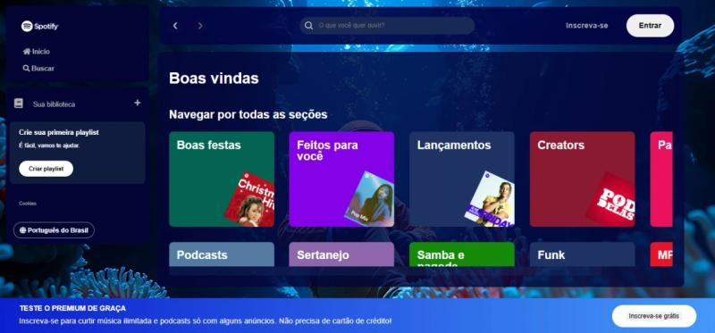

# 🎵 Spotify Clone

[](https://developer.mozilla.org/pt-BR/docs/Web/HTML)
[](https://developer.mozilla.org/pt-BR/docs/Web/CSS)
[](https://developer.mozilla.org/pt-BR/docs/Web/JavaScript)
[](#)

Clone da interface do Spotify desenvolvido com **HTML, CSS e JavaScript**.  
Projeto criado para praticar **layout responsivo**, **componentização de estilos** e **consumo de JSON** simulando uma API.

---

## 🔗 Demo
**GitHub Pages:** [https://kaiquebz.github.io/spotify-imers-o/](https://kaiquebz.github.io/spotify-imers-o/)

---

## 📸 Preview
)

---

## ✨ Funcionalidades
- 🎨 Interface inspirada no Spotify (sidebar, header, cards)
- 🔍 Busca de artistas com filtro em tempo real
- 📄 Dados carregados de `api-artists/artists.json`
- 🖱️ Animações e hover nos cards
- 📱 Layout responsivo

---

## 🚀 Tecnologias
- **HTML5**
- **CSS3** (Grid, Flexbox, variáveis CSS)
- **JavaScript (ES6+)**
- **JSON** (mock de API)

---

## 🧭 Como usar localmente
1. Clone o repositório:
   ```bash
   git clone https://github.com/KaiqueBz/spotify-imers-o.git
